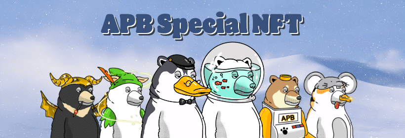

# Angry Polar Bears Special

北极熊还活着

“再这样下去，我们都会死。”
北极熊因为人类的自私而失去了生存的空间，因为没有食物可吃，它们变得越来越瘦。 感受到危机，他们在狭窄的冰川上寻求帮助并警告人类，但他们得到的只是塑料和热量，愤怒的北极熊切断了与人类的关系，创造了自己的世界。

最终，我们人类终有一天也会面临危机。 就像愤怒的北极熊！
请访问愤怒的北极熊，安抚愤怒的北极熊，让此类事情不再发生，我们可以共同生活。

