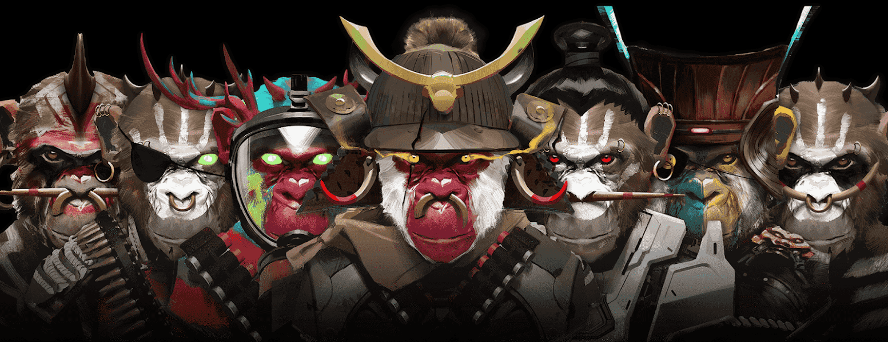

# ANGRY APES UNITED CLUB*

加入生活在虚拟世界中的 3333 只愤怒的猿。3333原始猿将在第一波发布。用 OG 猿繁殖、进化和升级您的猿。来玩，我的，在猴岛赢取奖励。AAA 持有者将有机会参加猴岛的独家活动和有限的座位。

ANGRY APES UNITED 是一个高实用性的 NFT 集合，包含 8,888 个 Angry Apes，允许持有者通过区块链游戏赚取额外的加密资产。

##### ▶ 什么是 Angry Apes United？

Angry Apes United 是一个 NFT（非同质代币）集合。存储在区块链上的数字艺术品集合。

##### ▶ 存在多少 Angry Apes United 代币？

总共有 8,888 个 Angry Apes United NFT。目前，4,556 位车主的钱包里至少有一个 Angry Apes United NTF。

##### ▶ Angry Apes United 最昂贵的销售是什么？

最昂贵的 Angry Apes United NFT 是 [Angry Apes United #242](https://www.nft-stats.com/asset/0x9546eeb89df8f010da4953c2ef456e282b3db25a/242)。它于 2022-07-31（22 天前）以 28.1 美元的价格售出。

##### ▶ Angry Apes United 最近卖出了多少台？

过去 30 天内售出了 10 个 Angry Apes United NFT。

##### ▶ 有哪些流行的 Angry Apes United 替代品？

许多拥有 Angry Apes United NFT 的用户还拥有 [Jungle Destroyers Official](https://www.nft-stats.com/collection/jungle-destroyers-official)、 [PugFrens](https://www.nft-stats.com/collection/pugfrens)、 [Bastard Penguins](https://www.nft-stats.com/collection/bastard-penguins)和 [Fantastic Alien ETH](https://www.nft-stats.com/collection/fantasticalieneth)。

