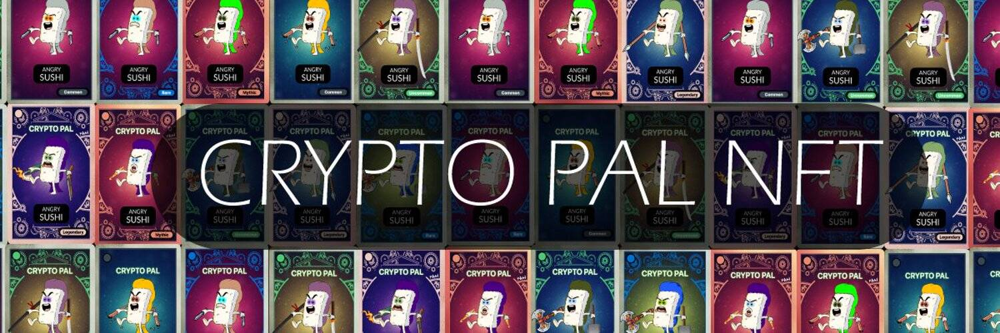

# CryptoPalNFT (Angry Sushi)

愤怒的寿司是 Crypto Pal 套装中的四个角色之一。

Crypto Pal 都始于对漫画和交易卡的热情。 收集漫画和交易卡/贴纸，如垃圾朋友孩子、口袋妖怪、魔术聚会 (MTG) 的时间比我们记忆的要长。 这种对卡片收藏品的热爱启发了我们创建 Crypto Pal。 如果您像我们一样对卡片收藏品充满热情，那么您来对地方了！ 我们有一个独特的数字收集有趣和古怪的角色，我们将随着时间的推移发布。 在每个版本中，这些集合每个都将不超过 1000 个项目。 这是 Crypto Pal 定价布局：

定价布局：
多边形链

常见 罕见 稀有 传奇 神话
0.001 以太币 0.003 以太币 0.005 以太币 0.007 以太币 0.009 以太币

