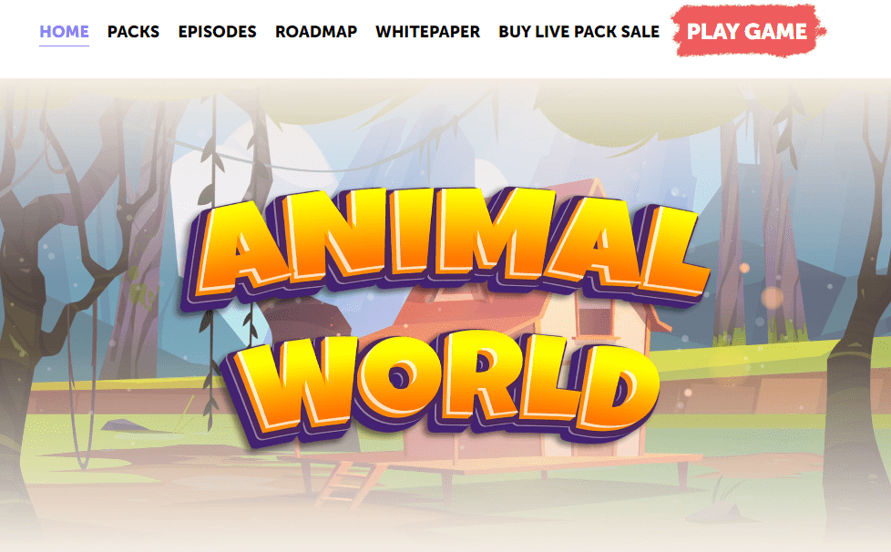

# Animal World

动物世界是一个P2E农场模拟游戏的蜡区块链.&nbsp;

当NFT遇到现实世界的效用时动物世界是一个动态的，标记化的项目，建立在碳中和的WAX区块链上。它提供了有趣的模拟游戏玩法，玩家可以收集，拥有，交易和交换农业资产，以及我们的代币AWC。我们动物世界致力于建立和实现一个多元化的生态意识个人社区，他们将为自我可持续和生态积极的农业做出贡献。该项目实时运行，具有用户友好的可访问性。

本文档将定期更新。此处提供的任何信息都可能发生变化，值可能会更新，但一般来说，基本结构保持不变，任何重大更改都将公布。Animal World旨在为使用均衡的nft和代币经济周期的用户提供分散的游戏体验。动物世界中的每个nft都是为了在用户完成市场订单时以AWC代币的形式产生被动收入。游戏玩法的核心将是每个用户必须遵循的动态升级系统，以便在游戏中取得进展。每日市场订单将仔细平衡，但每天随机生成，这将使所有用户在级别进展方面有公平的机会。早期的参与者将具有提高产量和更容易获得市场订单的优势。

