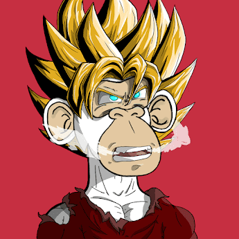

# Anime Ape Fight Club

Anime Ape Fight Club 是以太坊区块链上 5555 个随机生成的 NFT 的集合。每个 Anime Ape 特征和模型都经过精心手绘，细节精确。该系列的灵感来自 10 多个团队最喜欢的动漫系列。每只猿都可以让你进入搏击俱乐部，在那里每只猿都可以“对抗”他们的反派对手。

前 500 个将是免费的 + 汽油。剩余供应已停止。每笔交易 5 个。每个钱包 10 个。如果他们愿意，白名单可以再铸造 5 只猩猩。我们采用了 Azuki 优化的 ERC721A 合同，并根据 Anime Apes 的愿景对其进行了调整。向 Azuki 团队大喊。

