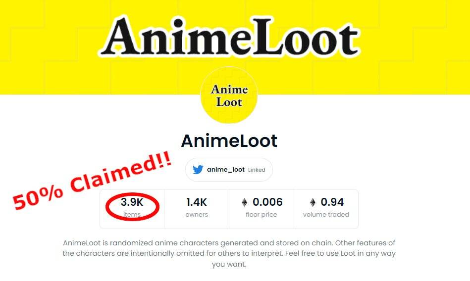

# AnimeLoot

AnimeLoot 是随机生成并存储在链上的动漫角色。故意省略了字符的其他特征，以供其他人解释。随意以任何你想要的方式使用 Loot。

AnimeLoot NFT - 常见问题

▶ 什么是动漫战利品？
AnimeLoot 是一个 NFT（非同质代币）集合。存储在区块链上的数字艺术品集合。
▶ 有多少 AnimeLoot 代币？
总共有 4,147 个 AnimeLoot NFT。目前，1,451 位所有者的钱包中至少有一个 AnimeLoot NTF。
▶ 最近卖出了多少 AnimeLoot？
过去 30 天内共售出 0 个 AnimeLoot NFT。

