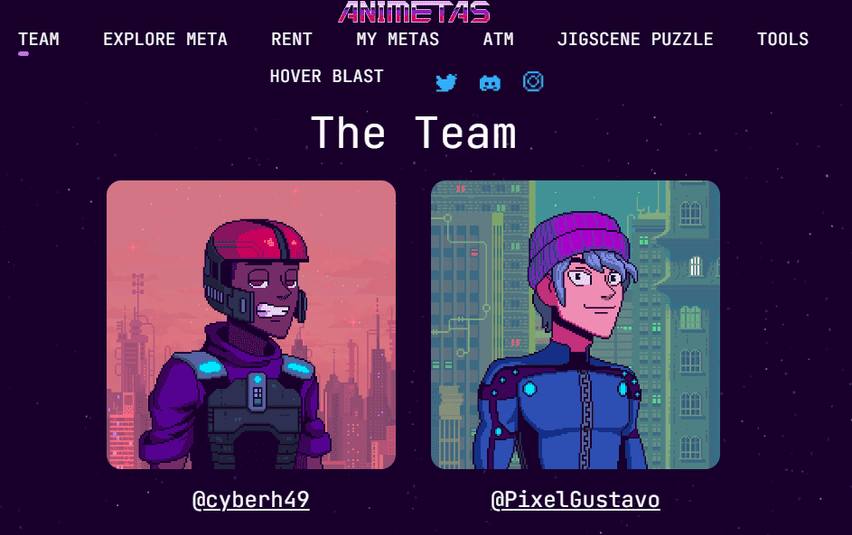

# Animetas

Animetas是人类(和其他物种)的虚拟实体，他们在以太坊区块链上铸造他们的大脑，并快乐地生活在Animetaverse -一个虚拟世界，灵感来自80年代和90年代的流行文化，创建于遥远的未来，那时地球不再适合人类居住。

这个系列非常包容，除了不同的物种，它有1:1的男女比例，它有跨性别的表现，所有年龄的角色，还有更多的惊喜。我们的各种特征是前所未有的- 100多种衣服，50多种发型，帽子，面具，等等。

