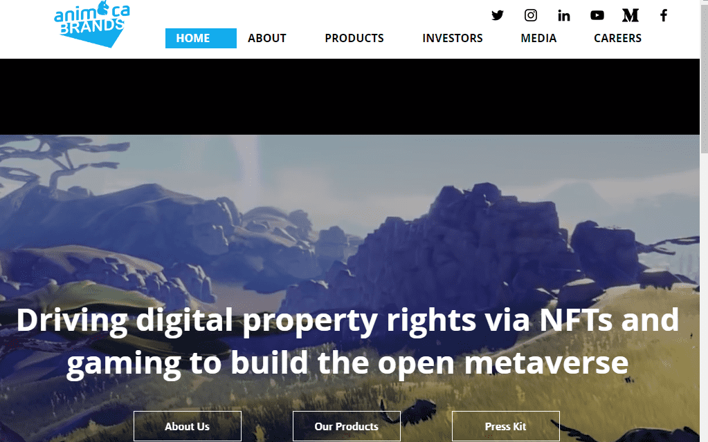

# Animoca Brands Launchpad

Animoca Brands Launchpad是一个象征性的预售平台，为新项目寻求进入广阔的，不断变化的区块链元宇宙。

Animoca Brands推出销售活动，发行代币券，其中包含销售代币的代币价值，可以在以后的日期兑换。但由于代币券是nft，它们可以在市场上自由交易。

**通过NFT和游戏推动数字产权，以建立开放的元宇宙**

Animoca Brands是[德勤科技高等奖](https://www2.deloitte.com/cn/en/pages/technology-media-and-telecommunications/events/technology-fast-hongkong-2021.html)得主，并入选《金融时报》[2021年亚太高增长公司](https://www.ft.com/high-growth-asia-pacific-ranking-2021)名单，是数字娱乐、区块链和游戏化领域的领导者，致力于推进数字产权，为建立开放的元宇宙做出贡献。该公司开发和发布广泛的产品组合，包括[REVV令牌](https://revvmotorsport.com/)和[SAND令牌](https://www.sandbox.game/);原创游戏，包括沙盒，疯狂的国王和疯狂的防御英雄;以及利用流行知识产权的产品，包括迪士尼，WWE，史努比狗狗，行尸走肉，Power Rangers，MotoGP™和Formula E。

