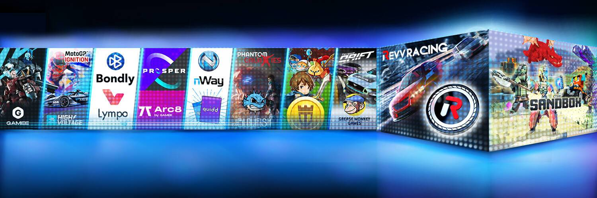

# Animoca Brands Launchpad

过去 7 天内没有售出 Animoca Brands Launchpad。

Animoca Brands Launchpad 是一个代币预售平台，适用于希望进入广阔且不断变化的区块链元界的新项目。

Animoca Brands Launchpad 销售活动，发行代币券，其中带有销售代币的代币价值，可以在以后兑换。但由于代币券是 NFT，它们可以在市场之间自由交易。

以前的 Launchpad 令牌发布包括 QUIDD 和 DOSE。

我们的社区成员可以使用自己或借来的 NFT 作为抵押品，在全球范围内申请贷款。虽然投资者可以通过为我们市场上提供的贷款融资来获得保证收益。

TrustNFT 技术解决方案将 DeFi 与 NFT 相结合，以增加急需的实用性并释放 NFT 成为实用金融工具的巨大潜力。

