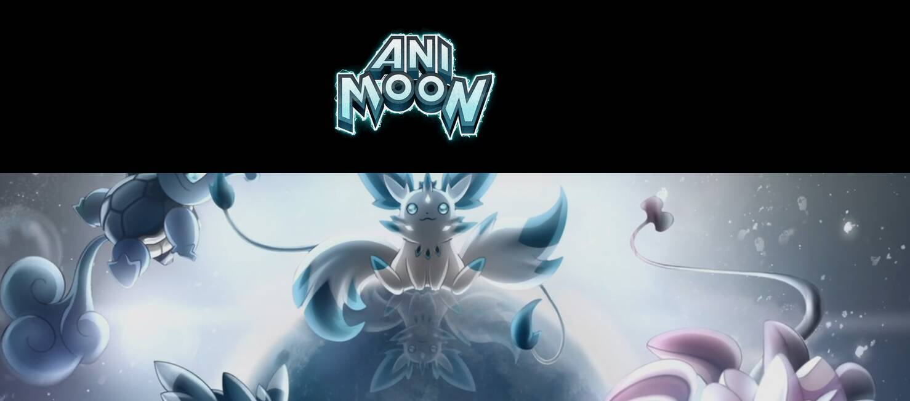

# Animoon Potion 2

Animoon Potion 2 NFT 在过去 7 天内售出 4 次。Animoon Potion 2 的总销售额为 175.32 美元。一份 Animoon Potion 2 NFT 的平均价格为 43.8 美元。Animoon Potion 2 拥有者 135 人，总供应量为 1,000 个代币。

Potion 2 将进化你的动画，把它变成一个全新的 NFT，更有价值，同时仍然保留它的特性！

Animoon 是在以太坊网络上运行的数字艺术作品 (NFT) 的集合。本网站只是一个允许参与者交换数字收藏品的界面。

 用户对自己的私人以太坊钱包的安全和管理负全部责任，并在批准之前验证本网站生成的所有交易和合同。

此外，由于 Animoon 智能合约在以太坊网络上运行，因此无法撤消、撤销或恢复任何交易。

