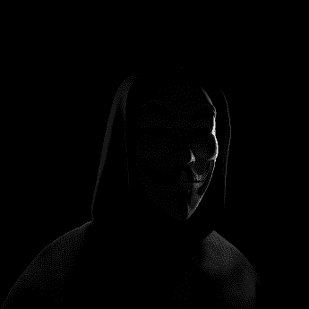

# Anonymous Society | NFT

我们的系列是为所有人制作的。我们的核心价值观是团结、权力下放和正义。我们与你站在一起。我们支持你。发现我们的系列：

匿名社会 | NFT NFT - 常见问题（FAQ）
▶ 什么是匿名社会 | NFT？
匿名社会 | NFT 是一个 NFT（Non-fungible token）集合。存储在区块链上的数字艺术品集合。
▶ 多少匿名社会 | NFT 代币存在吗？
共有259个匿名社团| NFT NFT。目前 132 位业主拥有至少一个匿名协会 | NFT NTF 在他们的钱包里。
▶ 多少匿名社会 | NFT 最近卖了？
共有 0 个匿名社团 | NFT 在过去 30 天内售出的 NFT。
▶ 什么是流行的匿名社会 | NFT 替代品？
许多拥有匿名社会的用户| NFT NFT 还拥有 KALASH47、 Alienverse-NFT、 Dragon Molly和 Bad Bears Genesis。

