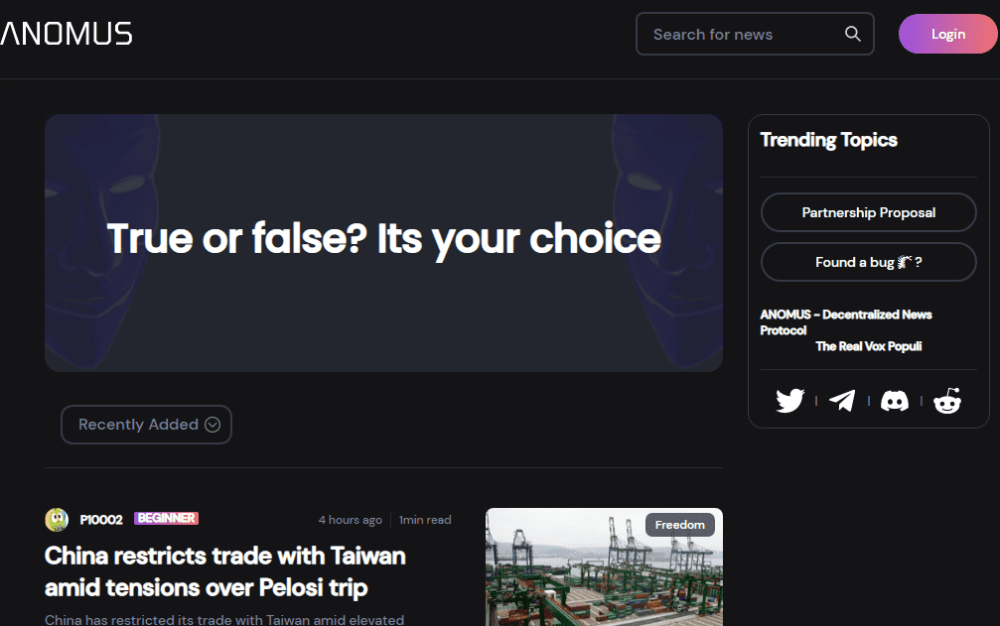

# ANOMUS

Anomus是一种面向全球的去中心化新闻协议。它的宗旨是让新闻报道再次公平、公正、平衡。该团队的目标是创建一个完全抵制假新闻的每日新闻协议，让每个人都能看到他们可以信任的新闻。ANOMUS上的每一篇文章都表示为NFT，并存储在区块链上。此外，ANOMUS的目标是创建一个完全分散的权威组织，来管理协议的发展和路线图。通过将出版商、读者和事实核查人员聚集到一个地方，并将DAO置于ANOMUS之上，就可以对其进行访问

**Anomus**是一个分散的新闻协议。它的创建旨在使新闻报道公平，公正和平衡。这是一个平台，旨在通过社区治理曝光虚假内容来简化经过验证的内容，新闻和专业新闻。这是一个面向世界的分散式新闻协议。它的创建旨在使新闻报道公平，公正和平衡。

今天，有许多新闻报道来源和共享中心，从持久的传统新闻供应商的数字化出版物，新时代的在线媒体门户网站，自称专家博主或播客，新闻聚合器协议，以利基为中心的报道以及政治或意识形态倾向的社交媒体资料。

