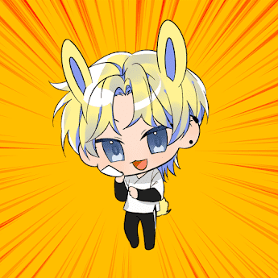

# AnonChibi by PHUNKY

Anon Chibi 是由韩国女艺术家手绘的 10,000 个生成 NFT 集合。该系列融合了欢快、可爱、顽皮、淘气、兴奋和简单的乐趣！这些赤壁犬带有猫的特征，为它们增添了强大的元素。他们经常和他们的人类伙伴一起打败坏人，在某些情况下也打败好人。在这个系列中有 CatGirls 和 CatBoys 是有吸引力的角色，他们保留了他们的人类形态，但具有微妙的猫一样的身体特征！适合全家人的可爱小甜饼！PHUNKY NFTs 的 AnonChibi 在过去 7 天内售出 7 次。PHUNKY 的 AnonChibi 总销售额为 6.31 美元。PHUNKY NFT 的一个 AnonCibi 的平均价格为 0.9 美元。PHUNKY 拥有者有 4,049 个 AnonChibi，拥有 10,000 个代币的总供应量。

