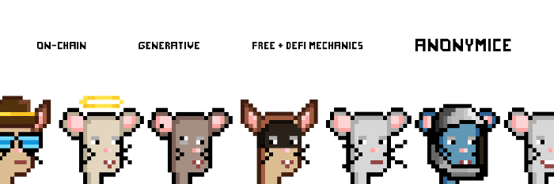

# Anonymice Cheese Club

独家奶酪俱乐部欢迎来自 Anonymice 的 6,450 只烧毁的#NFT老鼠完全链上，没有 IPFS。没有 API。仅以 0.02 ETH 的平价烧掉老鼠。Anonymice 是首批承诺 100% 链上方法的 NFT 项目之一，同时在初始铸币期间不收取任何版税，这引入了革命性的代币化铸币过程。该项目背后的团队是两个匿名的兄弟——MouseDev和 Kilo。

已经铸造了 10,000 个匿名者。6,450 个已被烧毁，仅剩 3550 个。唯一持有者 1418（2022 年 5 月 29 日）（40% 唯一持有者分布）2 Anonymice在第一次连锁育种活动中 



被用于繁殖和创建Anonymice 婴儿系列。

