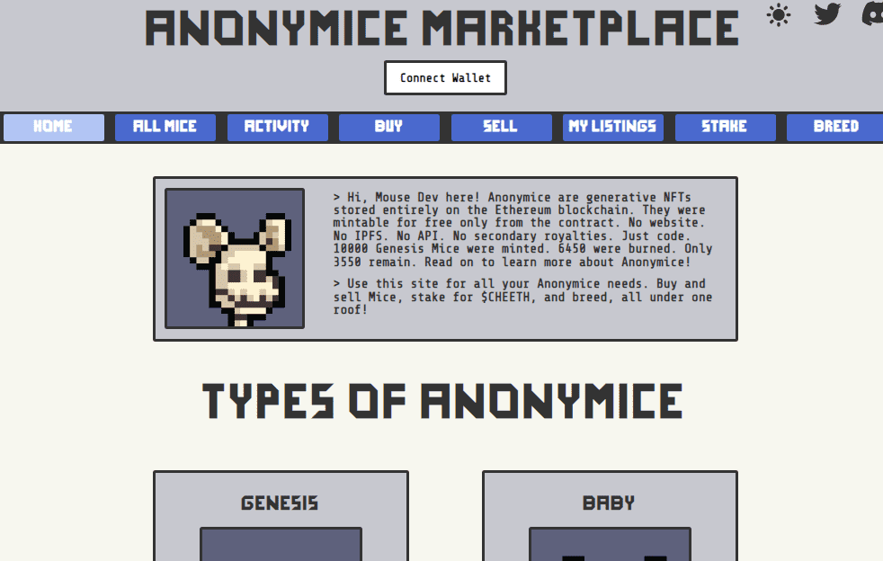

# Anonymice

欢迎来到OpenSea上Anonymice的家。发现这个集合中最好的项目。

Anonymice 是 3550 个 100% 链上生成 NFT 的集合。这意味着所有匿名数据都完全存储在以太坊区块链上。匿名将持续到永恒。

\> 什么是匿名？

匿名是3550个100%链上生成NFT的集合。这意味着所有匿名数据都完全存储在以太坊区块链上。虽然其他依赖于IPFS和API的项目很容易消失，但Anonymice将持续到永恒。

> 为什么我应该在OpenSea上使用这个市场？

OpenSea在现有5%的收藏版税的基础上额外收取2.5%的版税。匿名市场仅收取5%的收款版税，允许我们的用户保留其销售的额外2.5%。以老鼠通常出售的价格，这最终是一个可观的节省金额。

> 用户体验与 OpenSea 有何不同？

由于OpenSea的集中式性质，他们能够免费提供某些东西，例如降低房源价格。由于我们是完全分散的，用户必须为他们完成的每一次合同互动支付汽油，包括降低上市价格。

