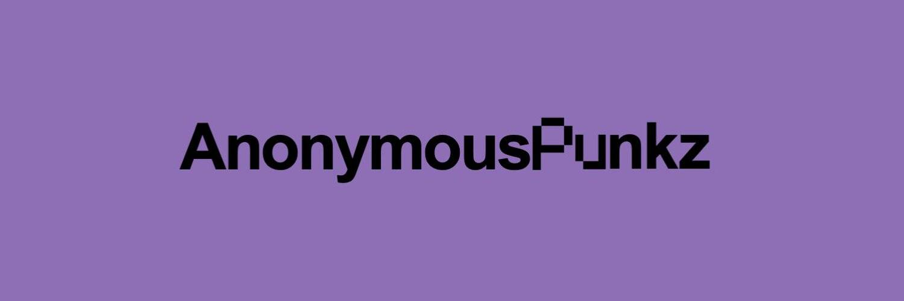

# Anonymous Punkz

10,000 个匿名朋克团结一致匿名直到被证明有罪我们支持和支持

▶ 什么是匿名朋克？
Anonymous Punk 是一个 NFT（Non-fungible token）集合。存储在区块链上的数字艺术品集合。
▶ 存在多少匿名朋克代币？
总共有 6 个匿名朋克 NFT。目前 4 位所有者的钱包中至少有一个 Anonymous Punk NTF。
▶ 最近卖出了多少匿名朋克？
过去 30 天内售出 0 个匿名朋克 NFT。

10000 供应

每个钱包免费 2 个，然后每个 0.0022

每笔交易最多 20 个

