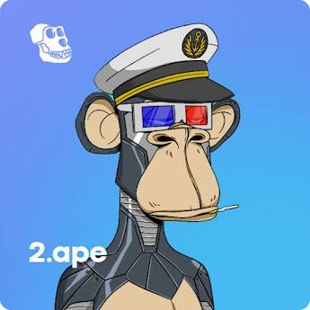

# ANS: Ape Name Service

没有域名，没有不和谐，没有路线图，没有网络，只有我们美丽的猿。

▶ 什么是 ANS：Ape 名称服务？
ANS：Ape Name Service 是一个 NFT（Non-fungible token）集合。存储在区块链上的数字艺术品集合。
▶ 存在多少 ANS: Ape Name Service 令牌？
总共有 27 个 ANS：Ape Name Service NFT。目前，12 位所有者的钱包中至少有一个 ANS：Ape Name Service NTF。
▶ 最昂贵的 ANS：Ape Name Service 销售是什么？
最昂贵的 ANS: Ape Name Service NFT 是 ANS: Ape Name Service #5。它于 2022-06-15（2 个月前）以 53.3 美元的价格售出。
▶ ANS: Ape Name Service 最近卖了多少？
过去 30 天内售出了 2 个 ANS：Ape Name Service NFT。

