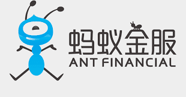

# ANT FINANCE

Ant 是一个堆叠平台，允许通过购买平台代币以 BUSD 产生利润。&nbsp;

该平台的兴趣在于它属于一个向上流动的投资者社区。 与功能路线图相关的未来添加也将允许通过标记化不动产或股票投资来分散投资。&nbsp;

此外，由于 DAO 的实施，您将成为项目的核心，让每个人都能发表自己的意见，并通过将他的知识带给社区来成长。

*我们通过科技创新，助力合作伙伴，为消费者和小微企业提供普惠便捷的数字生活及数字金融服务；*
*持续开放产品与技术，助力企业的数字化升级与协作；*
*在全球广泛合作，服务当地商家和消费者实现“全球收”、“全球付”和“全球汇”。*

## 数字生活

今天，支付宝已经从一个支付工具，成长为一站式数字生活平台。通过开放平台战略，引入数字金融、政务民生、本地生活等各领域服务方，为消费者提供一站式数字生活服务。

