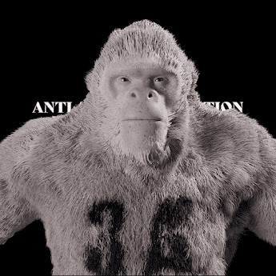

# ANTI-APE ASSOCIATION NFT

8888 反猿协会 NFT 上 ETH 区块链独家反猿协会 NFT。High Utility 9999 独家独特的抗猿协会

▶ 什么是反协会？
antiapeassociation 是一个 NFT（Non-fungible token）集合。存储在区块链上的数字艺术品集合。
▶ 存在多少反关联代币？
总共有 18 个抗关联 NFT。目前 2 位所有者的钱包中至少有一个 antiapeassociation NTF。
▶ 最近卖了多少antiapeassociation？
过去 30 天内售出 0 个抗关联 NFT。

反猿协会是一个以社区为重点的衍生 NFT 集合，包含 9,999 个 Rare Nft。 每个 NFT 都是使用 140 多种属性（如帽子、眼睛、皮肤等等）的组合通过算法生成的！ 反猿协会在以太坊 (ETH) 区块链上启动，旨在以可承受的价格提供高质量的艺术品，同时执行广泛的路线图。

