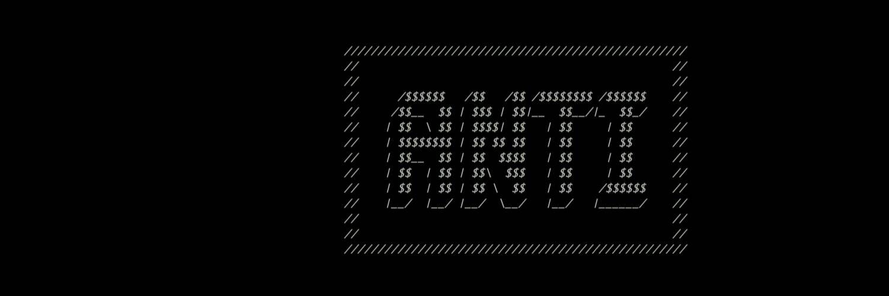

# Anti Collective

Anti是一个由 420 位制造商和不合适的人组成的秘密社团，他们分享关于所有加密货币的高信号模因和市场见解。
通过购买Antipass加入。
已经有了？连接你的钱包。
一些项目允许 WL 访问 Antipass 持有者。

Anti Collective NFT 在过去 7 天内售出 2 次。Anti Collective 的总销售额为 776.16 美元。一个 Anti Collective NFT 的平均价格为 388.1 美元。共有 352 个反集体所有者，拥有 1 个代币的总供应量。

▶ 什么是反集体？
Anti Collective 是一个 NFT（不可替代代币）集合。存储在区块链上的数字艺术品集合。
▶ 存在多少反集体代币？
总共有 1 个反集体 NFT。目前，352 位所有者的钱包中至少有一个 Anti Collective NTF。
▶ 最昂贵的反集体销售是什么？
出售的最昂贵的 Anti Collective NFT 是 Antipass。它于 2022-06-10（2 个月前）以 863.5 美元的价格售出。
▶ 最近卖出了多少反集体？
过去 30 天内售出了 9 个反集体 NFT。

