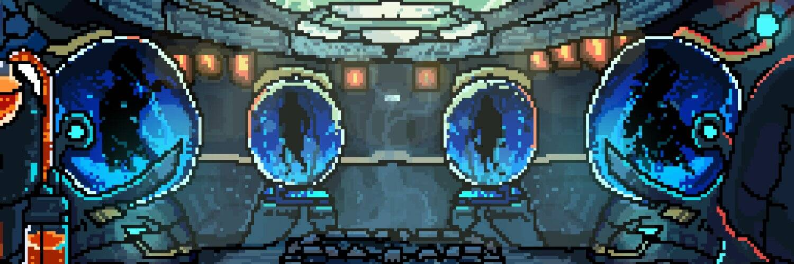

# Dyson Spheres

不死生物是人造的还是自然现象的问题迫在眉睫。这一年是 3024 年，我们的人口中有 70% 已被感染。50 年来，SLAYER CORP 一直致力于拯救人类。但是时间越来越近了。今天，我们坐在灭绝的边缘，按照教授的意愿，创造一种有效的解毒剂……黄昏集。死亡来敲门。你还醒着吗？

实验 X 是 ANTI LABS 创建的 GENESIS 系列。

一个 128 位、等距像素的 Zombies 和 SLAYERZ 集合，拥有多个不可预见的实用程序，这些实用
程序对 $Antidote 生态系统具有指数级的重要性。

