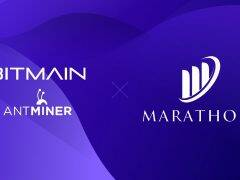

# AntMiner

种植比特币来发展你的矿场或出售比特币换取 BNB！

蚂蚁矿机（ANTMINER)）比特大陆自主研发并销售的加密数字货币服务器，是比特大陆旗下的重要品牌之一。 从2013年第一代蚂蚁矿机S1发布至今，蚂蚁矿机持续迭代多款矿机产品，以高收益、低功耗、强稳定性等特点广获市场好评。

比特大陆科技控股公司（以下简称比特大陆，英文BITMAIN）成立于2013年，是一家全球领先的科技公司，其产品包括算力芯片、算力服务器、算力云，主要应用于区块链和人工智能领域。

> 比特大陆总部位于北京市海淀区，在香港、新加坡、美国等地设有研发中心。本着聚焦主业，有序横向发展，成为一家世界顶尖的科技公司的企业愿景，比特大陆积极拓展算力中心的全球布局，不断提高区块链云计算的资源利用率，探索发现环境友好型区块链云计算技术。

