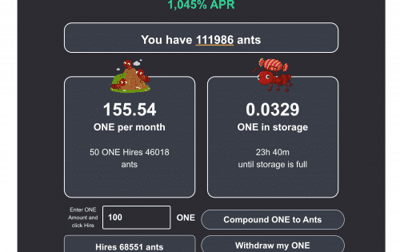

# AntsMining

<u>如何开始/工作</u>

<strong>合约：one1</strong><u><strong>蚂蚁</strong></u><strong>3uceludpamvyqm9fwvnejmgg8kfchfx84z / 0xecd708f319ff1a1eed8406ca97327996d083d938</strong>

这适用于希望获得长期利润和可持续性的用户。不适合那些想要立即获利的人最终会影响他人。

这不能与农场混淆。蚂蚁不是买来的，它们是被雇佣的，因此不能卖掉。一旦蚂蚁被雇用，它们就会无限期地为您工作，以每天 3% 的起始费率为您提供无限量的 ONE。

雇佣蚂蚁 &gt;蚂蚁找到一个 >复合&gt;提现一个&gt;利润！

第 1 步。使用 ONE 雇佣蚂蚁。

第 2 步。您的蚂蚁将开始狩猎，将它们找到的 ONE 放入您的蚁群。您可以在您的群体中使用 ONE 复合 AKA “雇用更多蚂蚁”，以提高您的狩猎成功率。

第 3 步。或者，您可以将 ONE 放入您的蚁群中，然后您的蚂蚁将再次开始填充您的蚁群。

蚂蚁会在长达 24 小时内不停地用 ONE 填充您的蚁群。 24 小时后，您的蚁群将满员并可能开始溢出，直到您通过雇佣更多蚂蚁或将它们装袋来使用蚁群中的 ONE。您可以随时“雇用更多蚂蚁”或将您的 ONE 放入口袋，但建议至少每 24 小时这样做一次。

