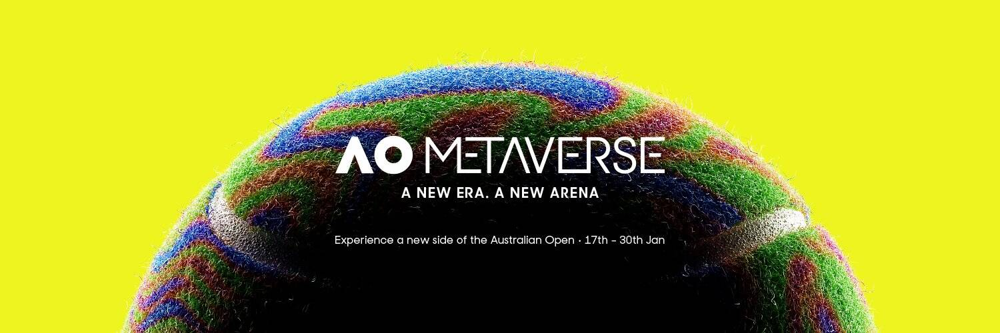

# AO Art Ball Collection

拥有球权。拥有球场。拥有当下。6,776 个生成的 AO Art Ball NFT，每个都与澳大利亚公开赛官方球场上的一个单独的情节相关联。

使用真实的比赛数据，找到比赛获胜点并将其分配给具有更新特征和元数据的 AO Art Ball NFT。澳大利亚公开赛的每一场比赛。

球场见。

▶ 什么是 AO 艺术舞会？
AO Art Ball 是一个 NFT（非同质代币）系列。存储在区块链上的数字艺术品集合。
▶ AO Art Ball 代币有多少？
总共有 6,776 个 AO Art Ball NFT。目前，3,878 位业主的钱包中至少有一个 AO Art Ball NTF。
▶ 最贵的 AO Art Ball 拍卖会是什么？
最贵的 AO Art Ball NFT 是 . 它于 2022 年 6 月 10 日（2 个月前）以 170 美元的价格售出。
▶ AO Art Ball最近卖出了多少？
过去 30 天内共售出 171 个 AO Art Ball NFT。
▶ 一个 AO 艺术球需要多少钱？
过去 30 天，最便宜的 AO Art Ball NFT 销售额低于 64 美元，最高销售额超过 123 美元。过去 30 天 AO Art Ball NFT 的中位价格为 91 美元。

