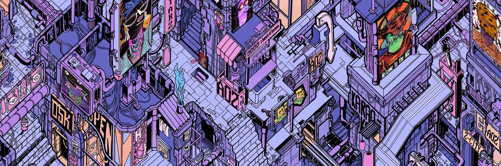

# AOZ

Z 时代公民是 1993 年手绘的独特且具有未来感的角色，致力于建立一个自给自足、自动化和和谐的世界，在这个世界中促进创新和协作系统来保护隐私。自由、朋克与和平是我们实现包容和去中心化世界愿景所需的精神。

什么是 Z 年龄 (AOZ) 公民？
AOZ（Age of Z）是首创的 PFP 项目，体现了 Z 世代社区的精神和价值观：包容、隐私和自由意志。AOZ 由 1993 年手绘的“公民”组成，每个人都有一套独特的未来主义特征和属性。AOZ 公民是元宇宙原住民，他们致力于建立一个自给自足、自主和和谐的世界，在这个世界中促进创新和协作系统来保护隐私。AOZ 元宇宙是一个包容和去中心化的社区，它既是赛博朋克，又是当代艺术。

