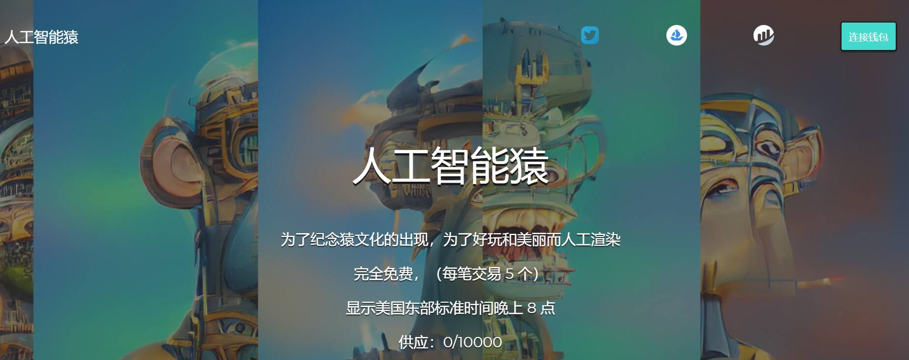

# Ape By AI

人工智能猿

为了纪念猿文化的出现，为了好玩和美丽而人工渲染

完全免费，（每笔交易 5 个）

显示美国东部标准时间晚上 8 点

▶ 什么是人工智能猿？
Ape By AI 是一个 NFT（非同质代币）集合。存储在区块链上的数字艺术品集合。
▶ Ape By AI 代币有多少？
总共有 10,000 个 Ape By AI NFT。目前，1,471 位所有者的钱包中至少有一个 Ape By AI NTF。
▶ 最昂贵的 Ape By AI 销售是什么？
AI NFT 出售的最昂贵的 Ape 是 AI APE #XXXX。它于 2022-06-07（3 个月前）以 1.8 美元的价格售出。
▶ Ape By AI 最近卖出了多少？
过去 30 天内，Ape By AI NFT 共售出 10 个。

