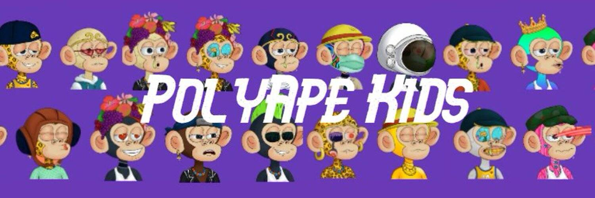

# Ape Kids Polygon Club

PolyApe Kids 是 Polygon GAS FREE 上随机生成的 NFT！网络 。根据定义的稀有系统，这 2300 个 PolyApes 中的每一个都具有使它们独一无二的属性。

干杯! 我们是第一个相信我们的 Metaverse 父母是 OG “Mutant Ape Yacht Club”和“Bored Ape Yacht Club”的人 :)

PolyApe Kids 是 Polygon GAS FREE 上随机生成的 NFT！网络 。根据定义的稀有系统，这 2300 个 PolyApes 中的每一个都具有使它们独一无二的属性。
干杯! 我们是第一个相信我们的 Metaverse 父母是 OG “Mutant Ape Yacht Club”和“Bored Ape Yacht Club”的人

