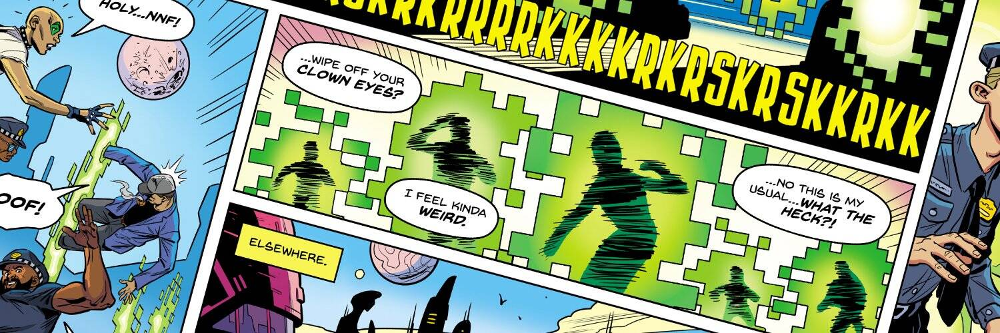

# Ape Madness

就在生活似乎再疯狂不过时，朋克们发现自己穿过奇怪的传送门进入了另一个充满超能力人类的世界，包括熟悉面孔的增强版！如果 gfunk、Courtney 和工作人员要活着回到 Origin City，他们可能只需要找到一种方法来自己承担超级增强属性，并冒险让这些“故障传送门”将他们送回正确的位置。从最初的 PUNKS 漫画系列到我们最近推出的 Origin Stories，解开这支不合群的收藏家、反叛者和加密货币人士背后的故事。

