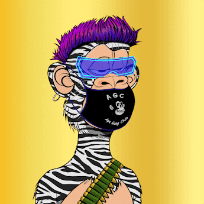

# ApeGangClub AGC

猿帮俱乐部是生活在多边形网络上的 5555 个随机生成的集合。每个 AGC 都是独一无二的，具有各种特殊特性。不隶属于 Yuga 实验室。过去 7 天内没有 ApeGangClub AGC 售出。

ApeGangClub AGC NFT - 常见问题

▶ 什么是 ApeGangClub AGC？
ApeGangClub AGC 是一个 NFT（Non-fungible token）集合。存储在区块链上的数字艺术品集合。
▶ ApeGangClub AGC 代币有多少？
总共有 167 个 ApeGangClub AGC NFT。目前 20 位车主的钱包中至少有一个 ApeGangClub AGC NTF。
▶ 最近卖出了多少台 ApeGangClub AGC？
过去 30 天内共售出 0 个 ApeGangClub AGC NFT。

