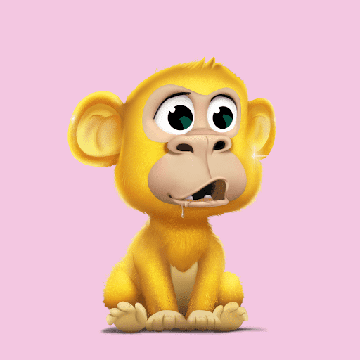

# Ape Kids Pixel Club

什么是猿儿童俱乐部？
Ape Kids Club 是由 9,999 只儿童猿组成的集合，它们是从我们拥有千年历史的魔法树中发芽的。Victorior 是一位深受喜爱且才华横溢的艺术老师，他将在我们俱乐部里照顾所有的 Kid Apes，并提供许多有计划的活动和惊喜。请在此处查看路线图部分。

举办猿童俱乐部有什么好处？
您的 Kid Ape 让您可以访问我们的 discord 社区并成为其成员，您将能够在其中成为 Back to School 频道、柠檬水摊、舞会以及我们路线图中计划中的其他惊喜的一部分。

