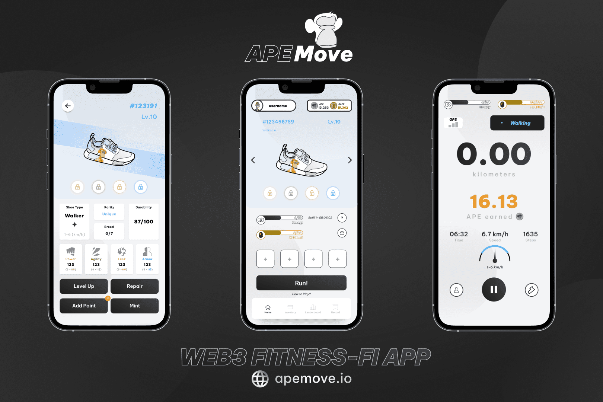

# APEmove

<strong>下载 APEMOVE APP：</strong>

<ul>
  <li><strong>GOOGLE PLAY：https://play.google.com/store/apps/details?id=io.apemove.app</strong></li>
</ul>

<strong>关于 APEMOVE：&nbsp;</strong>

APEmove 是围绕大多数人的一项基本日常活动而构建的——四处走动。我们是下一个项目，可以有效地实现有效的移动和赚取概念，并且完全免费加入。

用户以 Sneakers 的形式为自己配备 NFT。通过在户外散步、慢跑或跑步，用户将获得游戏内货币，这些货币既可以在游戏中使用，也可以兑现获利。

用户赚取 $APE &amp; $BAPE 并且每移动一分钟都会支付，这取决于 4 个主要因素： 运动鞋类型 - 每款运动鞋的基本 APE 回报不同。请参阅运动鞋属性部分，了解每种运动鞋类型的具体细分。

<ul>
  <li>Sneaker 的力量属性 - 力量越高，每分钟获得的 APE 越多。用户只能从10级到29级赚取APE。在30级，用户可以选择继续赚取APE，或切换赚取BAPE。用户可以在这两种收入模式之间自由切换。</li>
  <li>Sneaker 的敏捷属性 - 敏捷越高，每分钟获得的 BAPE 越多。 30级时，用户可以选择APE和BAPE的赚取方式。用户可以在这两种赚取方式之间自由切换。</li>
  <li>运动速度 - 为了最大限度地提高收入，用户应保持在各自运动鞋的最佳速度范围内。每当用户低于或高于此范围时，他们的收入将最多减少 90%，具体取决于与最佳范围的速度差异。&nbsp;</li>
</ul>

借助 Game-Fi，APEmove 旨在推动数百万人走向更健康的生活方式、应对气候变化并将公众连接到 Web 3.0，同时依靠其社交网络方面来构建一个持久的平台，以促进用户生成Web 3.0 内容。

免费 NFT 薄荷
APEMove 为您提供免费的 NFT 运动鞋
加入我们的 Web3 跑步应用程序并赚取 $APE 和 $BAPE

