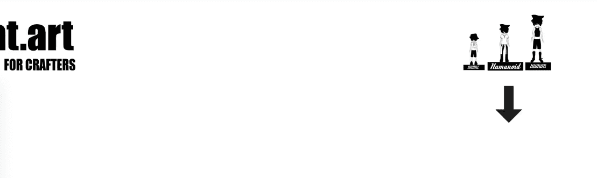

# Apes In Summer Uniques

Apes in Summer Uniques 手工制作的收藏在多边形链上。 检查收藏中的最佳物品。 所有手工制作的物品，Erc-721 验证合同。

▶ 什么是夏日独角猿？

Apes In Summer Uniques 是一个 NFT（不可替代代币）系列。存储在区块链上的数字艺术品集合。

▶ 有多少个 Apes In Summer Uniques 代币？

Summer Uniques NFT 中总共有 1,600 只 Apes。目前，20 位所有者的钱包中至少有一个 Apes In Summer Uniques NTF。

▶ 最近卖出了多少只夏之猿？

过去 30 天内售出了 1 个 Apes In Summer Uniques NFT。

▶ 什么是流行的 Apes In Summer Uniques 替代品？

许多拥有Apes In Summer Uniques NFT的用户还拥有 [Original Egg Gang](https://www.nft-stats.com/collection/original-egg-gang)、 [天地银行NFT](https://www.nft-stats.com/collection/tiandi-bank)、 [DajoCat_Project](https://www.nft-stats.com/collection/dajocat-v2-1)和 [AzokiEnemies](https://www.nft-stats.com/collection/azokienemies)。

