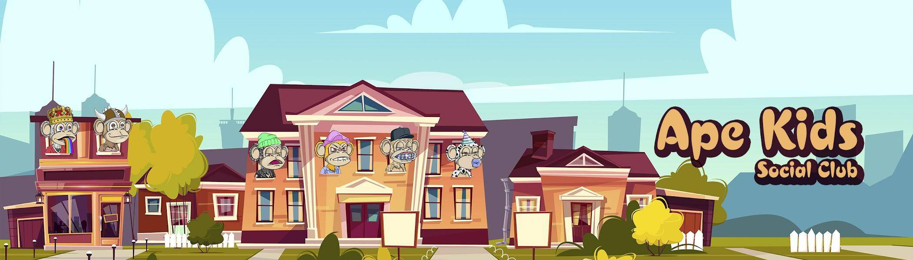

# Ape Kids Social Club

诞生于一个崎岖项目的灰烬中，背负着意想不到的持有者，他们有着共同的愿景并拒绝放弃——Ape Kids Social Club 是同类项目中的第一个：100% 由丛林湾社区为 Polygon 用户构建。

▶ 什么是猿童社交俱乐部？

Ape Kids Social Club 是一个 NFT（Non-fungible token）集合。存储在区块链上的数字艺术品集合。

▶ Ape Kids Social Club 代币有多少？

总共有 2,555 个 Ape Kids Social Club NFT。目前，34 位车主的钱包中至少有一个 Ape Kids Social Club NTF。

▶ 最近卖出了多少 Ape Kids Social Club？

过去 30 天内共售出 0 个 Ape Kids Social Club NFT。

▶ 流行的 Ape Kids Social Club 替代品有哪些？

许多拥有 Ape Kids Social Club NFT 的用户还拥有 [Dude Apes Club](https://www.nft-stats.com/collection/dude-apes-club)、 [Fluffy Bunny Club](https://www.nft-stats.com/collection/fluffy-bunny-club)、 [Robo Penguins](https://www.nft-stats.com/collection/robo-penguins)和 [Lost Apes Organization](https://www.nft-stats.com/collection/lost-apes-organization)。

