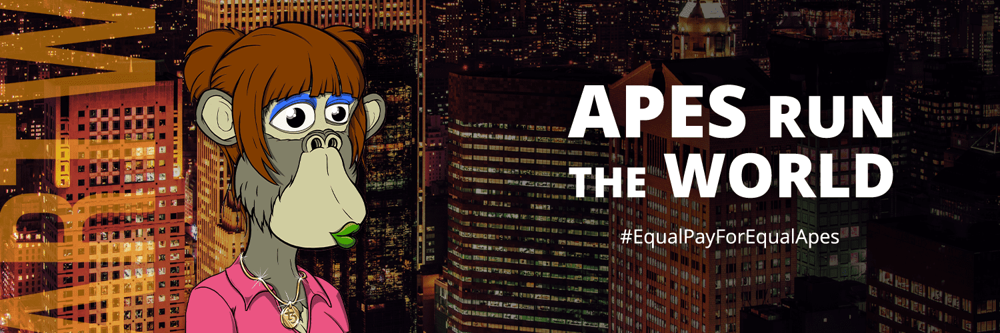

# Apes Run The World

世界上第一个雌性猿 NFT 合集 | 不和谐：https://discord.gg/artw | 外海

▶ 什么是猿跑世界？

Apes Run The World 是一个 NFT（非同质代币）集合。存储在区块链上的数字艺术品集合。

▶ Apes Run The World 代币有多少？

总共有 5,555 个 Apes Run The World NFT。目前，977 位车主的钱包中至少有一个 Apes Run The World NTF。

▶ 最昂贵的 Apes Run The World 促销活动是什么？

最昂贵的 Apes Run The World NFT 是 [Apes Run The World #4633](https://www.nft-stats.com/asset/0x22d202872950782012bac53346ee3dae3d78e0cb/4633)。它于 2022-07-25（28 天前）以 9.8 美元的价格售出。

▶ 最近卖出了多少人猿奔跑世界？

在过去的 30 天内，共售出 22 个 Apes Run The World NFT。

▶ Apes Run The World 需要多少钱？

在过去 30 天里，Apes Run The World 最便宜的 NFT 销售额低于 4 美元，最高销售额超过 9 美元。过去 30 天 Apes Run The World NFT 的中位价格为 6 美元。

▶ 什么是流行的 Apes Run The World 替代品？

许多拥有 Apes Run The World NFT 的用户还拥有 [PoodleDunk](https://www.nft-stats.com/collection/poodledunks-v2)、 [RoboCosmic](https://www.nft-stats.com/collection/robocosmic)、 [Ape Harmony Monster Club](https://www.nft-stats.com/collection/apeharmonymonsterclub)和 [TheSimpsonZPunks V2](https://www.nft-stats.com/collection/thesimpsonzpunksv2)。

