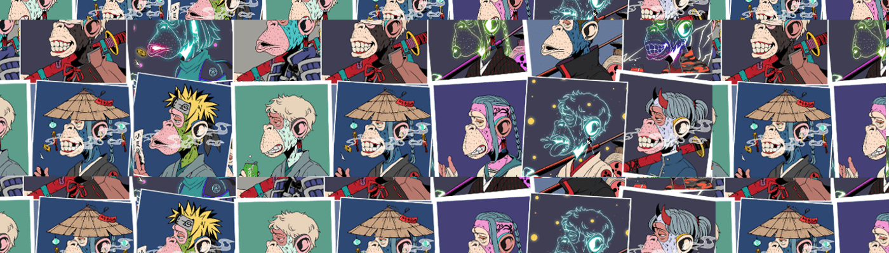

# Apes Zuki Club

欢迎来到 ApesZukiClub 官方

▶ 什么是 Apes Zuki 俱乐部？

Apes Zuki Club 是一个 NFT（非同质代币）集合。存储在区块链上的数字艺术品集合。

▶ Apes Zuki Club 代币有多少？

总共有 9,866 个 Apes Zuki Club NFT。目前，2,112 位车主的钱包中至少有一个 Apes Zuki Club NTF。

▶ 最昂贵的 Apes Zuki Club 销售是什么？

出售的最昂贵的 Apes Zuki Club NFT 是 [Ape Azuki Club #2124](https://www.nft-stats.com/asset/0xd9917441c1ed53d5a8bcf4b94d26d02609944bdf/2124)。它于 2022-06-24（大约 2 个月前）以 2.1 美元的价格出售。

▶ Apes Zuki Club 最近卖出了多少？

过去 30 天内售出了 30 个 Apes Zuki Club NFT。

▶ Apes Zuki 俱乐部的费用是多少？

在过去 30 天内，最便宜的 Apes Zuki Club NFT 销售额低于 2 美元，最高销售额超过 2 美元。在过去 30 天内，Apes Zuki Club NFT 的中位价格为 2 美元。

▶ 流行的 Apes Zuki Club 替代品有哪些？

许多拥有 Apes Zuki Club NFT 的用户也拥有 [COVIDBots！](https://www.nft-stats.com/collection/covidbots)， [骨头俱乐部](https://www.nft-stats.com/collection/bones-club)， [DoNotMintThis](https://www.nft-stats.com/collection/donotmintthis)和 [旧遗产](https://www.nft-stats.com/collection/old-legacy)。

