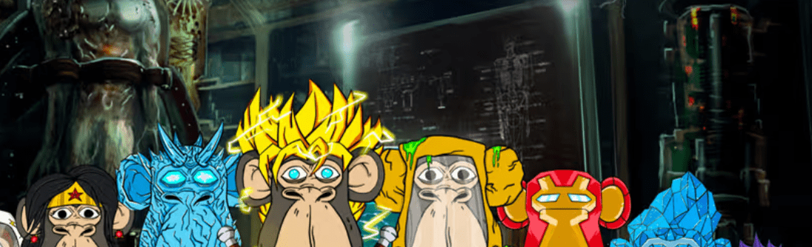

# ApesGenerationX

基于漫画/游戏的 NFT 项目，拥有 8000 名平民、880 名保护者和 8 只变异猿，准备在元宇宙中进行战斗。

ApesGenerationX NFT 在过去 7 天内售出 1 次。ApesGenerationX 的总销售额为 3.29 美元。一个 ApesGenerationX NFT 的平均价格为 3.3 美元。共有 327 名 ApesGenerationX 所有者，总供应量为 3,059 个代币。

▶ 什么是 ApesGenerationX？

ApesGenerationX 是一个 NFT（Non-fungible token）集合。存储在区块链上的数字艺术品集合。

▶ 存在多少 ApesGenerationX 代币？

总共有 3,059 个 ApesGenerationX NFT。目前，327 位所有者的钱包中至少有一个 ApesGenerationX NTF。

▶ 最昂贵的 ApesGenerationX 销售是什么？

最昂贵的 ApesGenerationX NFT 是 [Unreleased Token](https://www.nft-stats.com/asset/0xdb725d08a55ad0cd27ef4b5d490e78f36d13b8a5/27)。它于 2022-06-26（大约 2 个月前）以 76.8 美元的价格售出。

▶ 最近卖出了多少 ApesGenerationX？

过去 30 天内售出了 22 个 ApesGenerationX NFT。

▶ ApesGenerationX 的成本是多少？

在过去 30 天里，最便宜的 ApesGenerationX NFT 销售额低于 3 美元，最高销售额超过 45 美元。在过去 30 天内，ApesGenerationX NFT 的中位价格为 4 美元。

