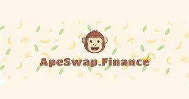

# ApeSwap

<strong>ApeSwap 是一个去中心化自治组织 (DAO)，它提供了一整套工具来探索和参与去中心化金融机会</strong>。使用我们的 DeFi Hub 中的产品，用户和合作伙伴可以以安全、透明和全球可访问的方式利用这一新的金融创新浪潮。 &nbsp;

<ul>
  <li><strong>加入</strong> ApeSwap 生态系统，与我们的社区互动，使用我们的 DeFi 产品，并购买我们的原生代币 BANANA 和 GNANA&nbsp;</li>
  <li><strong>使用我们的去中心化交易所在 BSC 和 Polygon 上的不同加密货币代币之间交换</strong>&nbsp;</li>
  <li><strong>为加密货币代币对提供流动性</strong>，以促进交换和接收赚取交易费用的流动性提供者 (LP) 代币（流动性挖矿）&nbsp;</li>
  <li><strong>在质押池中质押 BANANA 或 GNANA</strong>，从合作伙伴项目中<strong>赚取代币</strong></li>
  <li><strong>在 Yield Farms 中质押 LP 代币</strong>以<strong>赚取 BANANA&nbsp;</strong></li>
  <li><strong>通过 ApeSwap 借贷网络借贷</strong>加密资产&nbsp;</li>
  <li><strong>参与</strong>新加密项目的初始 Ape 产品</li>
</ul>

*ApeSwap是一种新型的去中心化加密货币交易所，它正在改变币安智能链（BSC）上去中心化资产交易所的格局。 除了存储和交易所工具外，ApeSwap还率先提出了一种新的代币销售设计“初始猿类产品”的概念。*

*这是官方的介绍，最初的上线时间为2021年3月31日。*

*与其他在Pancake与Bake上锁定流动性池子不同的项目相比，ApeSwap的野心明显要大的多，他想要做Exchange、想要做AMM、想要做机枪池、更想要做具有自己特点的IAO。 所以Ape更像是与PancakeSwap、BakeSwap同一赛道的竞争者，而非寄生在PCS与BKS上。*

