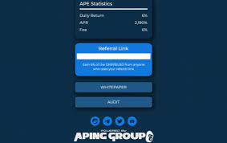
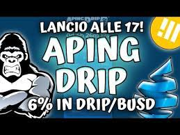

# Aping DRIP

这是一个简单的智能合约，充当 DRIP/BUSD 奖励池，只要奖励池中还有 DRIP/BUSD，每天都会返回池中 6%* 的 DRIP/BUSD ！用户可以选择收集（拿走他们的 DRIP/BUSD 奖励）或用他们的奖励重新雇佣更多的 APE（复合赚取的 DRIP/BUSD 奖励）。

只需雇用 APE，玩得开心，并在他们被开采时享受您的 DRIP/BUSD 奖励！

# 合同

Aping DRIP 合约经过验证、开源、不可变、值得信赖，并且在 https://bscscan.com/ 上可见

这一切意味着什么？

这意味着一旦部署了合约，合约就不再需要开发人员来继续按预期运行。每个人都可以阅读/审核并直接与代码交互，并在他们认为合适的时候做出自己的决定。合约部署后，任何人都无法以任何理由停止或更改它，甚至开发人员本人也无权更改或从合约中获取任何内容。

Aping DRIP 是一个去中心化的工具，它的用户可以完全免费地访问其内部和外部工作原理，以便他们可以就其对他们意图的有用性做出明智的决定。 Aping DRIP 社区和/或开发者执行的所有其他工作完全是可选的，不是继续运营所必需的，应被视为慈善社区贡献。

战略与信息

不要将 Aping DRIP 与农场混淆。矿工不是买来的，他们是被雇佣的，因此不能被卖掉。一旦矿工被雇佣，他们就会无限期地为你工作，为你提供无限量的 DRIP/BUSD，每日利率高达 6%。为了获得最佳的可持续性，每个人都最好遵循 6/1 策略。一日复租（复合）六天，第七天索赔一次。

根据 6/1 策略的社区参与度，每日最高回报率为 6%。

