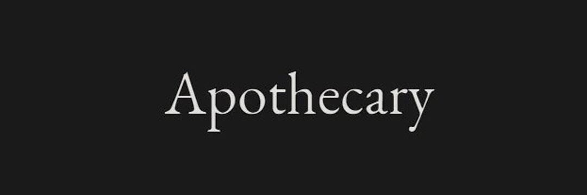

# Apothecary Loot (for Adventurers)

我们亲爱的冒险家们聚集在酒馆里，并得出结论认为任务是最重要的。 团队很快讨论并决定他们需要获得各种供应。 该小组的一位明智成员建议检查当地的萨满是否可以保证他们的安全。 最狡猾的人打趣说，可能有更多有用的混合物来满足他们的愿望。 最新加入团队的人告诉团队，那个特定的店主很奇怪，有点像奇数的混合袋，回忆起一些奇数，比如硬币的 3%。 队长砰地一声敲在桌子上，告诉新手，在他们最后一次成功的旅程之后，药师只会重新装满他们的战利品袋，以感谢他们的行为。 就这样，他们开始了前往药剂师的道路。

长期以来，我们滥用了我们的地球。我们行走的地面被重金属污染。我们的水充满了全氟辛烷磺酸，这是一种侵入性很强的物质，它存在于超过 98% 的美国人的血液中。由于大气中二氧化碳含量的上升，我们的空气质量很差。我们总是被告知它就是这样。我不接受。

