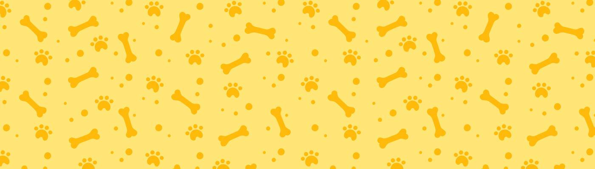

# Approving Bone

Approving Bone 最初用作 Approving Corgis 项目的铸币前通行证。 它现在用作社区的持续实用代币，提供增加的 $THORGI 质押收益、访问“Bone Gang”不和谐频道以及宣布的额外福利。

▶ 什么是认可骨头？

Approving Bone 是一个 NFT（非同质代币）集合。存储在区块链上的数字艺术品集合。

▶ 有多少个 Approving Bone 代币？

总共有 400 个 Approving Bone NFT。目前，289 位所有者的钱包中至少有一个 Approving Bone NTF。

▶ 最昂贵的 Approving Bone 销售是什么？

最昂贵的 Approving Bone NFT 是 [Approving Bone #130](https://www.nft-stats.com/asset/0x77c7f7dc1b592e884966f0dc4ae0ffb93cba1a7e/130)。它于 2022-07-25（29 天前）以 133.7 美元的价格售出。

▶ 最近卖出了多少 Approving Bone？

过去 30 天内售出了 2 个 Approving Bone NFT。

▶ 什么是流行的 Approving Bone 替代品？

许多拥有 Approving Bone NFT 的用户还拥有 [Approving Corgis](https://www.nft-stats.com/collection/approving-corgis-official)、 DiamondHands [Pass](https://www.nft-stats.com/collection/diamondhands-pass)、 [Generative Burger Club](https://www.nft-stats.com/collection/generative-burger-club)和 [Cryptoboyz CC0](https://www.nft-stats.com/collection/cryptoboyzcc0)。

