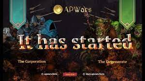

# APWars

 apwars是BSC上最具创新性的游戏化农业协议，在Defi中是最好，最有趣的APR。

**APWars 简介**

APWars 是一款游戏。我们知道，在此之前，基于区块链的游戏具有非常强大的财务吸引力，导致许多人专门为了赚钱和获得某种收入而玩游戏。我们不建议您以这种心态玩 APWars，因为它是一款旨在为人们提供娱乐而开发和维护的游戏。就像在任何游戏中一样，例如 Dota，反恐精英，英雄联盟，魔兽世界等，您可以向其他玩家出售物品并获得一些钱，或者游戏可以发展到冠军的地步，但是，这些事情只是期望。如果你的兴趣完全是为了赚钱，我们建议你寻找为此目的开发的 DeFi 工具，而不是玩 APWars，它使用区块链，但只是一个游戏。

**交换和质押**

这些是每个农业协议中最常见和传统上已知的特征。APWars 利用 Pancake Swap 的稳定性，您可以与它无缝交互以进行交易并从流动性池中获取代币。

