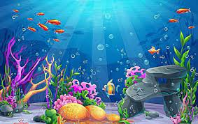

# Aquatic Wars

Aquatic Wars 是 100% 链上动态的 NFT 游戏。

游戏的目标很简单：<strong>成为海洋中最大的鱼。</strong>

只有当它们比它们大得多时，鱼才能吃其他鱼。
鱼通过吃其他鱼而变大。
当一条鱼产卵时，它有一个保护性气泡一天。在那段时间里，其他鱼不能吃它。
鱼可以服用类固醇来增加它们的大小。
每当一条鱼服用类固醇时，它就会使鱼的大小增加一倍。
鱼可以通过付费来扩大它们的保护泡沫或服用类固醇。
吃小鱼是免费的！
当一条鱼被吃掉后，这条鱼就不再出现在 NFT 的图像中。
当有人产鱼时，铸币价格上涨 0.1%。

吃其他鱼，扩大你的保护泡泡，服用类固醇，成为海洋中最大的鱼。 要了解有关游戏的更多信息，请在此处输入：

www.aquaticwars.com

