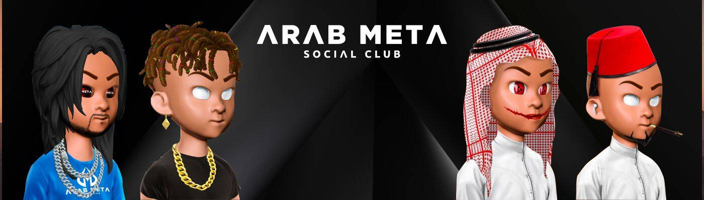

# Arab Meta Social Club

AMSC 是 3200 个阿拉伯 Metas 的集合，可让您访问 Metaverse 的精英，以及无穷无尽的实用程序列表。 去 DISCORD 并加入我们美丽的社区。 http://discord.gg/arabmetanft

▶ 什么是阿拉伯元社交俱乐部？

Arab Meta Social Club 是一个 NFT（非同质代币）集合。存储在区块链上的数字艺术品集合。

▶ 有多少阿拉伯 Meta Social Club 代币？

总共有 3,200 个阿拉伯 Meta Social Club NFT。目前，1,280 位车主的钱包中至少有一个阿拉伯 Meta Social Club NTF。

▶ 最昂贵的阿拉伯 Meta Social Club 销售是什么？

出售的最昂贵的阿拉伯 Meta Social Club NFT 是 [阿拉伯 Meta](https://www.nft-stats.com/asset/0x259bc3540a68c3747f5af9634fd36c86e37e549a/1371)。它于 2022-06-04（3 个月前）以 27.3 美元的价格售出。

▶ 最近卖出了多少阿拉伯 Meta Social Club？

过去 30 天内售出了 11 个阿拉伯 Meta Social Club NFT。

▶ 阿拉伯 Meta Social Club 的费用是多少？

在过去 30 天里，最便宜的阿拉伯 Meta Social Club NFT 销售额低于 14 美元，最高销售额超过 27 美元。过去 30 天内，Arab Meta Social Club NFT 的中位价格为 20 美元。

▶ 什么是流行的阿拉伯 Meta Social Club 替代品？

许多拥有阿拉伯 Meta Social Club NFT 的用户还拥有 [ItIsTheEnd Foundation Pass](https://www.nft-stats.com/collection/itistheend-foundation-pass)、 [Doodle character club](https://www.nft-stats.com/collection/doodle-character-club)、 [0N1 Corp](https://www.nft-stats.com/collection/0n1-corp)和 [SPOONER NFT](https://www.nft-stats.com/collection/spooner-nft)。

