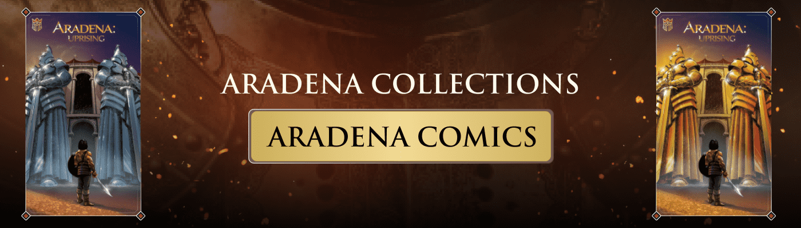

# Aradena Comics

过去 7 天内，Aradena Comic的勇士被售出 19 次。阿拉德纳勇士的总销售额为 1.66 万美元。一个 Aradena NFT 勇士的平均价格是 87.3 美元。拥有 1,613 名勇士勇士的 Aradena 拥有者，总供应量为 8,000 个代币。

▶ 什么是 Aradena 漫画？

Aradena Comics 是一个 NFT（非同质代币）系列。存储在区块链上的数字艺术品集合。

▶ Aradena Comics 代币有多少？

总共有 300 个 Aradena Comics NFT。目前，129 位所有者的钱包中至少有一个 Aradena Comics NTF。

▶ 最昂贵的 Aradena Comics 销售是什么？

出售的最昂贵的 Aradena Comics NFT 是 [Aradena Uprising: Issue 1](https://www.nft-stats.com/asset/0xe644fa2b37013754168d372258dfcf503f326314/18)。它于 2022 年 6 月 6 日（3 个月前）以 397.2 美元的价格售出。

▶ 最近卖出了多少 Aradena Comics？

过去 30 天内共售出 6 个 Aradena Comics NFT。

▶ 有哪些流行的 Aradena Comics 替代品？

许多拥有 Aradena Comics NFT 的用户还拥有 [Women of Aradena](https://www.nft-stats.com/collection/women-of-aradena)、 [The Galactics](https://www.nft-stats.com/collection/galacticsnft)、 [Warriors of Aradena](https://www.nft-stats.com/collection/warriors-of-aradena)和 [The Bornless: Collection 1](https://www.nft-stats.com/collection/the-bornless)。

