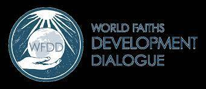

# Aram Test FBCL

Aram Test FBCL NFT 在过去 7 天内售出 2 次。Aram Test FBCL 的总销售额为 5.67 美元。一份 Aram Test FBCL NFT 的平均价格为 2.8 美元。有 2 个 Aram Test FBCL 所有者，总共拥有 3 个代币。

▶ 什么是 Aram 测试 FBCL？

Aram Test FBCL 是一个 NFT（Non-fungible token）集合。存储在区块链上的数字艺术品集合。

▶ 存在多少个 Aram Test FBCL 代币？

总共有 3 个 Aram Test FBCL NFT。目前 2 位所有者的钱包中至少有一个 Aram Test FBCL NTF。

▶ 最昂贵的 Aram Test FBCL 销售是什么？

出售的最昂贵的 Aram Test FBCL NFT 是 [FBCL](https://www.nft-stats.com/asset/0xae9fa0a24fe01582b61dbf004c63d728e31f0564/1)。它于 2022-07-02（大约 2 个月前）以 5.5 美元的价格售出。

▶ 最近卖出了多少 Aram Test FBCL？

过去 30 天内售出了 2 个 Aram Test FBCL NFT。

