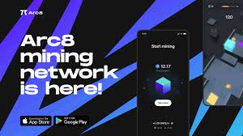
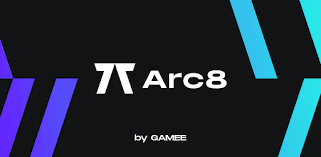

# Arc8 by GAMEE

Arc8 是一款赚取移动游戏体验的游戏，其中电子竞技与加密货币相结合。 在多个视频游戏中登顶，粉碎你的对手并赢得 GMEE 代币。 你的成功只在你手中。 GAMEE 的 Arc8 为数百万游戏玩家带来区块链体验。

## 关于 Arc8

Arc8 作为一款带有加密奖励的移动游戏应用程序推出，玩家可以在面对面的比赛或大型锦标赛中通过一组独特的高技能、超休闲游戏来测试你的反应能力和战略思维。

Arc8 的愿景是成为区块链的拱廊。一个虚拟的街机屋，人们在这里玩耍、在超休闲游戏中竞争、获得奖励并相互互动。一个连接游戏玩家、品牌赞助商和合作伙伴以及游戏创作者的地方。

借助区块链技术，虚拟街机由社区拥有和管理

###### 奖励是如何计算的？

每个活动都有一个可用的固定奖池，并根据整个活动期间所投注的 LP 数量按比例分配。您在 LP 中质押的份额越高，您的回报就越大。
