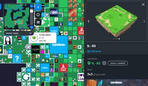

# Arcade Land Estate

Arcade Land NFT 在过去 7 天内售出 105 次。Arcade Land 的总销售额为 $43.24k。一份 Arcade Land NFT 的平均价格为 411.8 美元。有 5,201 名 Arcade Land 所有者，拥有 10,000 个代币的总供应量。

[Twitter](https://twitter.com/arcadedotinc)
想象一个所有#metaves 都可以互操作和连接的新世界。

▶ 什么是 Arcade Land？

Arcade Land 是一个 NFT（不可替代代币）集合。存储在区块链上的数字艺术品集合。

▶ Arcade Land 代币有多少？

总共有 10,000 个 Arcade Land NFT。目前，5,201 位业主的钱包中至少有一个 Arcade Land NTF。

▶ 什么是最昂贵的 Arcade Land 销售？

售出的最昂贵的 Arcade Land NFT 是 [Arcade Land Mega #19](https://www.nft-stats.com/asset/0x4a8c9d751eeabc5521a68fb080dd7e72e46462af/19)。它于 2022 年 6 月 7 日（3 个月前）以 1.45 万美元的价格售出。

▶ 最近售出了多少 Arcade Land？

过去 30 天内售出了 552 个 Arcade Land NFT。

▶ Arcade Land 需要多少钱？

在过去 30 天里，Arcade Land NFT 最便宜的销售额低于 198 美元，最高销售额超过 882 美元。过去 30 天内，Arcade Land NFT 的中位价格为 307 美元。

▶ 什么是流行的 Arcade Land 替代品？

许多拥有 Arcade Land NFT 的用户还拥有 [Los Muertos World](https://www.nft-stats.com/collection/los-muertos-world)、 [Toxic Skulls Club](https://www.nft-stats.com/collection/toxic-skulls-club)、 [Shinsekai Portal](https://www.nft-stats.com/collection/shinsekai-portal)和 [The Association](https://www.nft-stats.com/collection/the-association-nft)。

