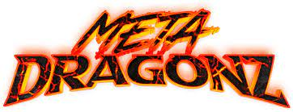
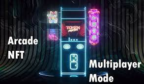

# ArcadeNFT

通过将互动游戏与来自新晋艺术家、知名创作者和艺术家的惊人艺术形式相结合 知名品牌。

我们希望我们的收藏品系列既有趣又独特 玩上瘾！ 加入我们的冒险之旅，将经典街机游戏带入 NFT 的未来。

## 我们喜欢街机 游戏，我们喜欢加密货币

2020 年末，我们的团队开始将终极经典街机 NFT 系列的想法、草图和概念图放在一起。

经过数月的技术迭代，我们终于准备好与更广泛的社区分享我们第一个包含交互式 NFT 的系列的 BETA 版本。

成为我们旅程的一部分。

## 带回 复古

第一个带有原始计算机芯片的“固态”街机取代了 80 年代出现的旋转磁盘“堆栈”。这使得头部艺术作品得以扩展，并且用视觉和音乐讲述故事成为弹球流行的主要驱动力。

我们将 80 年代的街机体验与当今流行的 NFT 收藏品相结合，为流行文化流派带来了新的活力。

加入我们的冒险之旅，将经典街机游戏与新的和著名创作者的音乐和艺术相结合，带入未来。

