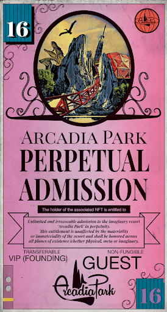

# ArcadiaParkPerpetualAdmission

机械化抽象是 1,234 个链上生成抽象艺术作品的集合。 与为在个人资料图片中使用而优化的 NFT 项目不同，机械化抽象针对宽纵横比进行了优化。 生成过程和渲染脚本都在链上。

▶ 什么是 ArcadiaParkPerpetualAdmission？

ArcadiaParkPerpetualAdmission 是一个 NFT（非同质代币）集合。存储在区块链上的数字艺术品集合。

▶ 存在多少 ArcadiaParkPerpetualAdmission 代币？

总共有 30 个 ArcadiaParkPerpetualAdmission NFT。目前，26 位业主的钱包中至少有一个 ArcadiaParkPerpetualAdmission NTF。

▶ 最近售出了多少 ArcadiaParkPerpetualAdmission？

过去 30 天内售出了 0 个 ArcadiaParkPerpetualAdmission NFT。

