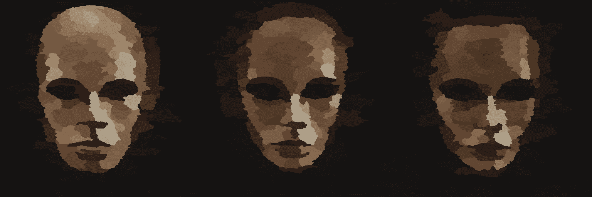

# Arch0

Arch0: The Cult of Jhakeet 是一款 NFT 驱动的 Discord RPG 游戏，其风格源自早期的 Rogue-like RPG 和 MUD。 Arch0 被空投给 Char0 持有者。

Arch0 NFT 在过去 7 天内售出 21 次。Arch0 的总销售额为 0.02 美元。一个 Arch0 NFT 的平均价格为 0 美元。Arch0 拥有者 2,057 名，总供应量为 10,000 个。

▶ 什么是 Arch0？

Arch0 是一个 NFT（Non-fungible token）集合。存储在区块链上的数字艺术品集合。

▶ Arch0 代币有多少？

总共有 10,000 个 Arch0 NFT。目前 2,057 位所有者的钱包中至少有一个 Arch0 NTF。

▶ Arch0 最昂贵的交易是什么？

售出的最昂贵的 Arch0 NFT 是 [Arch0 #1994](https://www.nft-stats.com/asset/0x550cb8e52ddf63114c26b8c673ae8fb5d7df2407/1994)。它在 2022-07-02（大约 2 个月前）以 0 美元的价格出售。

▶ 最近卖出了多少 Arch0？

过去 30 天内售出了 21 个 Arch0 NFT。

▶ Arch0 需要多少钱？

过去 30 天，Arch0 NFT 最便宜的销售额低于 0 美元，最高销售额为 0 美元以上。Arch0 NFT 的中位价格在过去 30 天内为 0 美元。

▶ 流行的 Arch0 替代品有哪些？

许多拥有 Arch0 NFT 的用户还拥有 [WaterBe4nZuki](https://www.nft-stats.com/collection/waterbe4nzuki)、 [Old Legacy](https://www.nft-stats.com/collection/old-legacy)、 [DegenOkayBears](https://www.nft-stats.com/collection/degenbears)和 [EL NUMEROS](https://www.nft-stats.com/collection/elnumeros)。

